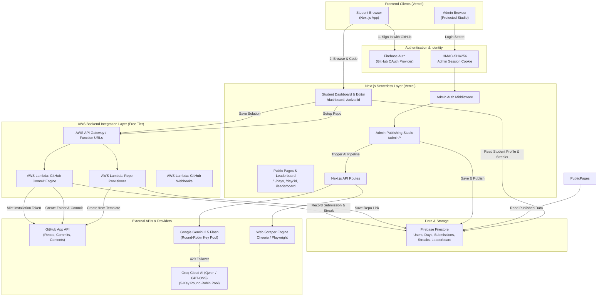
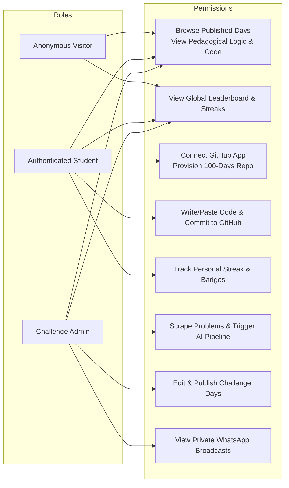
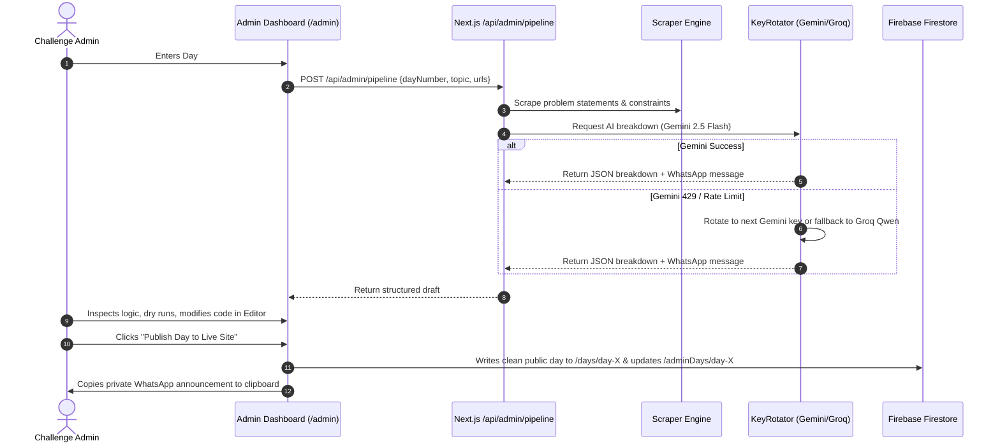
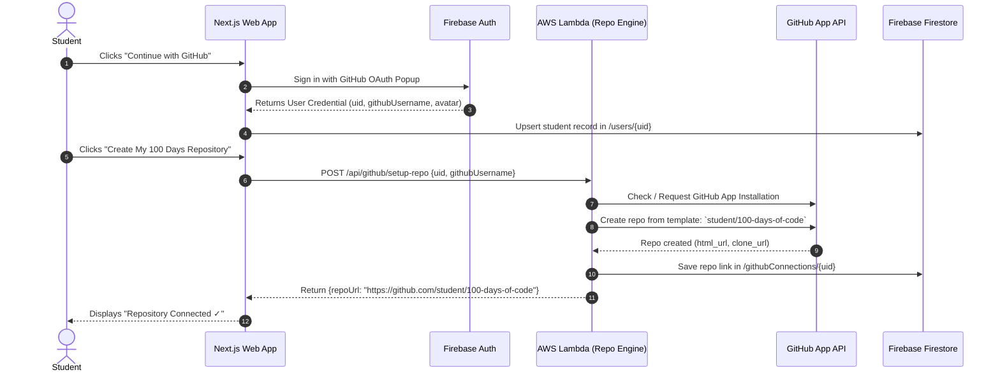
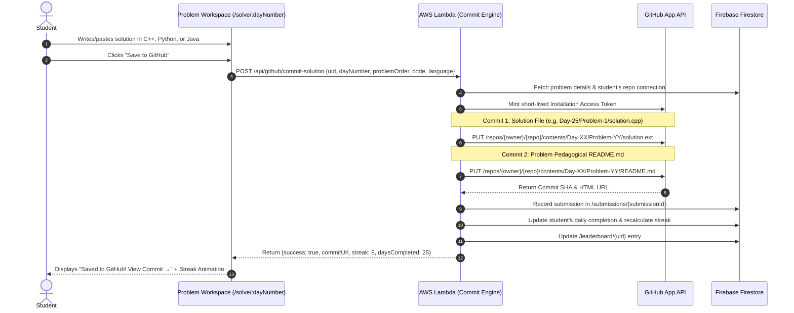
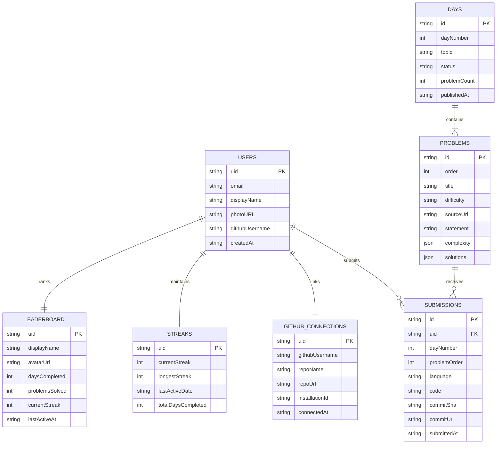
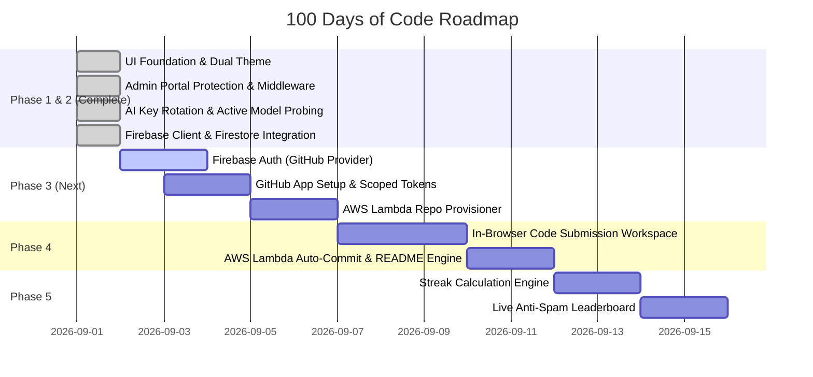

# 100 Days of Code — Comprehensive System Design Document

**Author:** Atharva Baodhankar  
**Domain:** `challenge.atharvabaodhankar.me`  
**Status:** Approved Next-Gen Architecture  
**Last Updated:** September 2026  

---

## Table of Contents

1. [Executive Summary & Product Vision](#1-executive-summary--product-vision)
2. [Goals & Non-Goals](#2-goals--non-goals)
3. [System Architecture Diagram](#3-system-architecture-diagram)
4. [Technology Stack](#4-technology-stack)
5. [User Roles & Access Control](#5-user-roles--access-control)
6. [Core Workflows](#6-core-workflows)
   * 6.1 Admin Content Curation & AI Pipeline
   * 6.2 Student Authentication & GitHub Provisioning
   * 6.3 Student Code Submission & Auto-Commit Engine
   * 6.4 Streak & Leaderboard Recalculation
7. [GitHub App & Repository Automation Architecture](#7-github-app--repository-automation-architecture)
   * 7.1 GitHub App vs. Personal Access Tokens (PAT)
   * 7.2 Repository Template & Directory Structure
   * 7.3 Automated Commit & Portfolio Generation
8. [Gamification, Streak & Leaderboard Engine](#8-gamification-streak--leaderboard-engine)
   * 8.1 Daily Completion Criteria
   * 8.2 Streak Calculation Engine
   * 8.3 Anti-Spam Leaderboard Ranking Algorithm
   * 8.4 Motivational UI & Activity Visualization
9. [AWS Integration Layer & Free-Tier Capacity Modeling](#9-aws-integration-layer--free-tier-capacity-modeling)
   * 9.1 Responsibilities Separation (Firebase vs. Lambda)
   * 9.2 400-Student Workload & Invocations Modeling
   * 9.3 Compute Time (GB-Seconds) Budget
   * 9.4 Critical AI Guardrail: Admin-Only Generation
   * 9.5 Routing Strategy: API Gateway vs. Lambda Function URLs
   * 9.6 Full Infrastructure Health & Free-Tier Matrix
10. [AI Generation & Round-Robin Key Orchestration](#10-ai-generation--round-robin-key-orchestration)
11. [Data Architecture & Firestore Schema](#11-data-architecture--firestore-schema)
12. [API Specification](#12-api-specification)
13. [Security, Privacy & Threat Modeling](#13-security-privacy--threat-modeling)
14. [UI/UX Design System & Principles](#14-uiux-design-system--principles)
15. [Error Handling, Fallback & Rate Limiting](#15-error-handling-fallback--rate-limiting)
16. [Project Structure](#16-project-structure)
17. [Phased Implementation Roadmap](#17-phased-implementation-roadmap)

---

## 1. Executive Summary & Product Vision

**100 Days of Code** is a high-impact DSA learning platform, automated GitHub portfolio generator, and gamified streak system designed for software engineering students and challenge participants.

Instead of merely browsing problem links on external sites, the platform provides an integrated, 3-pillar learning lifecycle:

```text
┌─────────────────────────────────────────────────────────────────────────────────┐
│                           100 DAYS OF CODE PLATFORM                             │
├─────────────────────────┬──────────────────────────┬────────────────────────────┤
│       1. LEARNING       │        2. CODING         │      3. GAMIFICATION       │
│  Daily Curated Problems │ In-Browser Code Editor   │ 🔥 Continuous Streaks      │
│  Pedagogical Intuition  │ Auto GitHub Repo Setup   │ 🏆 Anti-Spam Leaderboard   │
│  Step-by-Step Logic     │ 📁 Day/Problem Structure │ 📊 Day 1–100 Matrix        │
│  Dry Run State Traces   │ 🚀 Auto Commit & Push    │ 📈 Milestone Badges        │
│  C++ / Python / Java    │ 📄 Auto-Generated README │ ✨ Motivational Ranking    │
└─────────────────────────┴──────────────────────────┴────────────────────────────┘
```

### The Student Journey
1. **Browse Today's Challenge:** Read the problem statement, intuition, logic breakdown, and complexities.
2. **Sign In with GitHub:** One-click authentication via Firebase Auth with GitHub OAuth provider.
3. **Provision Challenge Repo:** The platform provisions `username/100-days-of-code` from a template via our GitHub App.
4. **Code & Save Solution:** Write or paste the verified solution in C++, Python, or Java and click **"Save to GitHub"**.
5. **Instant Portfolio Commit:** AWS Lambda / Backend commits the code into `Day-XX/Problem-YY/solution.ext` and generates a pedagogical `README.md` in their repo.
6. **Streak & Leaderboard:** The student's streak increases, activity is logged, and the public leaderboard updates in real-time.

---

## 2. Goals & Non-Goals

### 2.1 Primary Goals
* **Automated GitHub Portfolio:** Turn 100 days of consistency into a verifiable, structured GitHub repository (`username/100-days-of-code`) containing 100+ commits, structured folders, clean code, and auto-generated problem READMEs.
* **Server-Side GitHub Security:** Use a scoped **GitHub App** with server-side installation tokens. Never expose or request GitHub Personal Access Tokens (PATs) in the browser.
* **Frictionless Student Identity:** Firebase Authentication with GitHub OAuth provider for instant profile creation.
* **Accurate, Cheat-Resistant Gamification:** Calculate real continuous daily streaks and rank students using a multi-factor algorithm (Days Completed > Problems Solved > Current Streak).
* **Rapid Admin Workflow (< 2 mins/day):** Admin pastes 1–3 URLs -> AI parses problems, creates intuition, logic, dry run, and multi-language solutions -> Generates WhatsApp announcement -> Admin reviews & publishes.
* **Zero/Near-Zero Operating Cost:** Leverage free tiers across Google Gemini 2.5 Flash, Groq Cloud, Firebase Firestore, AWS Lambda (1M free req/mo + 400k GB-s compute), and Vercel.

### 2.2 Non-Goals (Current Scope)
* **Direct Browser-to-GitHub Commits:** Direct client-side calls to GitHub API with user tokens are strictly prohibited for security.
* **Local In-Browser Code Judge / Test Sandbox:** V1 validates submissions based on code submission to GitHub. Arbitrary code execution sandboxes (e.g. Judge0 / Docker microVMs) are deferred to Phase 6.
* **Automated WhatsApp Dispatch via Meta Business API:** Avoids third-party Meta Business verification and per-template messaging costs; WhatsApp broadcast remains a 1-click clipboard operation for the admin.

---

## 3. System Architecture Diagram



---

## 4. Technology Stack

| Layer | Technology | Rationale & Free-Tier Justification |
| :--- | :--- | :--- |
| **Frontend Framework** | Next.js 16 (App Router) + TypeScript | React Server Components, Turbopack, responsive client caching. |
| **Styling & Icons** | Tailwind CSS v4 + Lucide React | Clean, high-contrast, zero AI-slop, dual theme (Light default + Dark toggle). |
| **Student Auth** | Firebase Authentication (GitHub Provider) | Instant OAuth sign-in, zero password management, trusted GitHub identity. |
| **Admin Auth** | Server-Side HMAC-SHA256 Session Cookie | Middleware guarded, zero client leakage, protected `/admin/*` routes. |
| **Primary Database** | Firebase Firestore | Real-time listeners, flexible document schema, generous free tier (50K reads/day). |
| **GitHub Integration** | Official GitHub App (Server-Side) | Scoped repository permissions, automatic installation tokens, no personal access token risks. |
| **Backend Integration Layer** | AWS API Gateway + AWS Lambda (Node.js 22) | 1,000,000 free requests/mo + 400k GB-s compute, sub-second latency. |
| **AI Primary Engine** | Google Gemini 2.5 Flash / 3.6 Flash | Free tier on Google AI Studio, native JSON mode, rapid generation (< 2s). |
| **AI Fallback Engine** | Groq Cloud (`qwen/qwen3.6-27b`, `openai/gpt-oss-120b`) | Free tier, 5-key round-robin pool with automatic failover on rate limits. |
| **Validation** | Zod v3 | Strict runtime type-checking for AI payloads, GitHub webhooks, and submissions. |

---

## 5. User Roles & Access Control



---

## 6. Core Workflows

### 6.1 Admin Content Curation & AI Pipeline



### 6.2 Student Authentication & GitHub Provisioning



### 6.3 Student Code Submission & Auto-Commit Engine



---

## 7. GitHub App & Repository Automation Architecture

### 7.1 GitHub App vs. Personal Access Tokens (PAT)

| Security Aspect | Personal Access Token (PAT) ❌ | GitHub App Integration ✅ |
| :--- | :--- | :--- |
| **Token Storage** | User pastes raw token in browser; extreme leak risk. | Stored server-side only; private key mints 1-hour tokens. |
| **Scope of Access** | Access to all user repositories (dangerous). | Scoped strictly to the single `100-days-of-code` repository. |
| **User Experience** | Cumbersome: manual PAT generation on GitHub. | 1-click install dialog; seamless modern SaaS experience. |
| **Revocation** | User must manually delete token. | User can uninstall the App with 1 click in GitHub Settings. |

### 7.2 Repository Template & Directory Structure

When a student provisions their repository, it initializes with a standard template:

```text
username/100-days-of-code/
│
├── README.md                          # Main repository dashboard & progress badges
│
├── Day-01/
│   ├── Problem-1-Two-Sum/
│   │   ├── solution.cpp               # User's submitted code
│   │   └── README.md                  # Auto-generated problem statement & approach
│   └── Problem-2-Contains-Duplicate/
│       ├── solution.py
│       └── README.md
│
├── Day-02/
│   └── Problem-1-Valid-Anagram/
│       ├── solution.java
│       └── README.md
│
└── ...
```

### 7.3 Auto-Generated Problem README Template

Every time a solution is committed, Lambda automatically commits a structured `README.md` alongside the code file:

```markdown
# Problem 1: Find Missing Number (Day 25)

- **Difficulty:** Easy
- **Topic:** Arrays & Hashing
- **Source:** [TakeUForward Challenge](https://challenge.atharvabaodhankar.me/day/25)
- **Language:** C++

## Problem Statement
Given an array nums containing n distinct numbers in the range [0, n], return the only number in the range that is missing from the array.

## Pedagogical Intuition & Approach
Use the XOR property where `x ^ x = 0` and `x ^ 0 = x`. XOR all numbers from 0 to N and XOR all elements in the array. The remaining value is the missing number.

## Complexity Analysis
- **Time Complexity:** O(N) — Single linear scan
- **Space Complexity:** O(1) — Constant auxiliary memory

---
*Committed via [100 Days of Code Challenge Platform](https://challenge.atharvabaodhankar.me)*
```

---

## 8. Gamification, Streak & Leaderboard Engine

### 8.1 Daily Completion Criteria
To avoid punishing students who have heavy academic or work schedules on multi-problem days:
> **A challenge day is marked as COMPLETE for a student if they successfully commit at least ONE (1) problem for that day.**

### 8.2 Streak Calculation Engine
* **Current Streak:** Consecutive active days ending today or yesterday. If a student misses a calendar day, the current streak resets to 1 upon their next submission.
* **Longest Streak:** Highest historical continuous streak achieved.
* **Last Active Date:** Stored in ISO UTC string format.

```typescript
export function calculateNewStreak(
  currentStreak: number,
  longestStreak: number,
  lastActiveDateStr?: string
): { currentStreak: number; longestStreak: number; streakMaintained: boolean } {
  const today = new Date().toISOString().split("T")[0];
  if (!lastActiveDateStr) {
    return { currentStreak: 1, longestStreak: Math.max(1, longestStreak), streakMaintained: true };
  }

  const lastDate = new Date(lastActiveDateStr).toISOString().split("T")[0];
  if (lastDate === today) {
    return { currentStreak, longestStreak, streakMaintained: true };
  }

  const yesterday = new Date(Date.now() - 86400000).toISOString().split("T")[0];
  if (lastDate === yesterday) {
    const updated = currentStreak + 1;
    return { currentStreak: updated, longestStreak: Math.max(updated, longestStreak), streakMaintained: true };
  }

  // Streak broken
  return { currentStreak: 1, longestStreak, streakMaintained: false };
}
```

### 8.3 Anti-Spam Leaderboard Ranking Algorithm
To prevent students from gaming the leaderboard by spamming duplicate submissions, ranking uses a hierarchical multi-key sort:

$$\text{Rank Sort Priority} = \begin{cases} 
1. & \text{Days Completed } (\text{descending}) \\
2. & \text{Total Unique Problems Solved } (\text{descending}) \\
3. & \text{Current Active Streak } (\text{descending}) \\
4. & \text{Earliest Milestone Timestamp } (\text{ascending})
\end{cases}$$

### 8.4 Motivational UI Layout

```text
┌─────────────────────────────────────────────────────────────────────────────┐
│ 100 DAYS OF CODE — GLOBAL LEADERBOARD                                      │
├─────────────────────────────────────────────────────────────────────────────┤
│ Your Progress: Day 25/100  [████████████░░░░░░░░] 25%   🔥 8 Days Streak    │
│ Your Current Position: #6 on Global Leaderboard                            │
├─────┬──────────────────────┬──────────────────┬──────────────┬──────────────┤
│ Pos │ Student              │ Days Completed   │ Problems     │ Streak       │
├─────┼──────────────────────┼──────────────────┼──────────────┼──────────────┤
│ 🥇1 │ Atharva Baodhankar   │ 25 / 100         │ 48 solved    │ 🔥 25 Days   │
│ 🥈2 │ Tejas Patil          │ 24 / 100         │ 45 solved    │ 🔥 24 Days   │
│ 🥉3 │ Riya Sharma          │ 22 / 100         │ 40 solved    │ 🔥 19 Days   │
│  4  │ Aditya Verma         │ 20 / 100         │ 38 solved    │ 🔥 14 Days   │
│  5  │ Sarah Jenkins        │ 19 / 100         │ 35 solved    │ 🔥 12 Days   │
└─────┴──────────────────────┴──────────────────┴──────────────┴──────────────┘
```

---

## 9. AWS Integration Layer & Free-Tier Capacity Modeling

### 9.1 Responsibilities Separation (Firebase vs. Lambda)

The core architectural principle of the platform is:
> **Firebase handles all high-frequency reads, auth, and state. AWS Lambda ONLY wakes up for sensitive, privileged backend integrations.**

```text
               Vercel
                 │
          Next.js Web App
                 │
    ┌────────────┴────────────┐
    │                         │
    ▼                         ▼
 Firebase                  AWS Lambda (Node.js 22)
(Reads, Auth & State)     (Privileged Operations Only)
 ├── User Profiles         ├── GitHub Repository Creation
 ├── Published Days        ├── GitHub Commits & README Generation
 ├── Problems              ├── GitHub Installation Token Minting
 ├── Streaks Cache         ├── AI Content Pipeline (Admin Only)
 └── Leaderboard Views     └── GitHub Webhook Ingestion
```

### 9.2 400-Student Workload & Invocations Modeling

AWS Lambda usage is billed by **invocations and execution duration**, not the number of registered users.

AWS Lambda provides **1,000,000 requests/month** and **400,000 GB-seconds/month** of compute in the perpetual free tier.

#### Pessimistic Invocations Breakdown (400 Active Daily Students):

| User Action | Routed To | Lambda Invoked? | Monthly Invocations (400 Students) |
| :--- | :--- | :--- | :--- |
| **Open Landing Page / Dashboard** | Next.js / Edge | ❌ No Lambda | 0 |
| **Browse Published Days & Problems** | Firestore Client | ❌ No Lambda | 0 |
| **Sign In with GitHub** | Firebase Auth | ❌ No Lambda | 0 |
| **View Leaderboard & Streaks** | Firestore Client | ❌ No Lambda | 0 |
| **Provision Challenge Repo** (One-time) | AWS Lambda | ✅ Yes (1/user) | 400 / month |
| **Save Code Solution to GitHub** | AWS Lambda | ✅ Yes (1–3/day) | $400 \times 3 \times 30 = \mathbf{36,000}$ / month |
| **Code Save Retries / Updates** | AWS Lambda | ✅ Yes (~2 extra) | $400 \times 2 \times 30 = \mathbf{24,000}$ / month |
| **Admin AI Generation Pipeline** | AWS Lambda | ✅ Yes (3/day) | $3 \times 30 = \mathbf{90}$ / month |
| **Total Pessimistic Monthly Invocations** | — | — | **~60,490 invocations / month** |

$$\text{Free Tier Usage} = \frac{60,490}{1,000,000} = \mathbf{6.05\%} \quad (\text{Over } 93\% \text{ safety headroom remaining})$$

Even if every student triggered 20 Lambda calls per day ($400 \times 20 \times 30 = 240,000$ calls/mo), usage would only reach **24%** of the free allowance.

### 9.3 Compute Time (GB-Seconds) Budget

Lambda compute is calculated as: $\text{Executions} \times \text{Duration (seconds)} \times \text{Memory (GB)}$.

* Allocated Memory: **512 MB** ($0.5\text{ GB}$)
* Average Execution Duration: **300 ms** ($0.3\text{ seconds}$)
* Monthly Executions: **240,000** (Heavy stress assumption)

$$\text{Monthly Compute} = 240,000 \times 0.3\text{ s} \times 0.5\text{ GB} = \mathbf{36,000\text{ GB-seconds}}$$
$$\text{Free Allowance Usage} = \frac{36,000}{400,000} = \mathbf{9.0\%} \quad (\mathbf{91\%}\text{ compute headroom})$$

### 9.4 Critical AI Guardrail: Admin-Only Generation

> [!CAUTION]
> **AI models are NEVER invoked on student problem views.**  
> Pre-generating problem explanations and storing them in Firestore isolates AI cost completely from student count:
> $$400\text{ students } \neq 400\text{ AI calls}$$
> Admin curates 3 problems/day $\rightarrow 3 \times 30 = \mathbf{90\text{ AI generations/month total}}$.

### 9.5 Routing Strategy: API Gateway vs. Lambda Function URLs

1. **AWS API Gateway (HTTP API):** Includes 1,000,000 free calls/month for the first 12 months for eligible accounts. Useful when centralized throttling and stage variables are desired.
2. **AWS Lambda Function URLs:** Native HTTPS endpoints built directly into Lambda with **zero additional endpoint fees** (billed solely by normal Lambda compute/request pricing). Best suited for direct Next.js backend proxy calls.

### 9.6 Full Infrastructure Health & Free-Tier Matrix

| Component | Target Role | Expected Monthly Usage (400 Users) | Free Tier Capacity | Health Status |
| :--- | :--- | :--- | :--- | :--- |
| **AWS Lambda** | Repo & Commit Engine | ~60,000 – 240,000 requests | 1,000,000 req / mo | 🟢 **Zero Cost** (< 24%) |
| **Lambda Compute** | Memory $\times$ Duration | ~10,000 – 36,000 GB-s | 400,000 GB-s / mo | 🟢 **Zero Cost** (< 10%) |
| **Firebase Auth** | GitHub OAuth | ~400 MAU | 50,000 MAU / mo | 🟢 **Zero Cost** (< 1%) |
| **Firestore** | Reads & Submissions | ~30,000 reads/day | 50,000 reads / day | 🟢 **Zero Cost** |
| **GitHub App API** | Commits & Contents | ~36,000 API calls | 5,000 calls / hr / install | 🟢 **Zero Cost** |
| **Gemini 2.5 Flash** | AI Generation | ~90 admin calls / mo | 15 RPM / 1,500 RPD | 🟢 **Zero Cost** |
| **Groq Cloud** | AI 5-Key Fallback | Fallback only (< 10/mo) | 30 RPM / key | 🟢 **Zero Cost** |
| **Vercel** | Next.js Edge/SSR | Normal web traffic | Hobby / Pro Tier | 🟢 **Zero Cost** |

---

## 10. AI Generation & Round-Robin Key Orchestration

### 10.1 Multi-Key Pool & Model Strategy
* **Primary Provider:** Google Gemini `gemini-2.5-flash` (or `gemini-3.6-flash`).
* **Fallback Provider:** Groq Cloud `qwen/qwen3.6-27b` (or `openai/gpt-oss-120b`).
* **Key Pool:** Comma-separated keys in environment variables rotated via memory-persisted `KeyRotator`.

```text
[Admin Curation Trigger]
           │
           ▼
    Gemini KeyRotator ────► (Key 1) ──► 200 OK ──► Zod Schema Validation ──► Success
           │
           ├─► 429 Rate Limit ──► (Key 2) ──► 200 OK ──► Success
           │
           └─► All Gemini Keys Exhausted
                    │
                    ▼
             Groq KeyRotator ──► (Groq Key 1..5) ──► 200 OK ──► Success
```

---

## 11. Data Architecture & Firestore Schema



---

## 12. API Specification

### 12.1 Public Endpoints
* `GET /api/days` — Lists all published days.
* `GET /api/days/:dayNumber` — Retrieves public problems for a specific day.
* `GET /api/leaderboard` — Returns paginated leaderboard entries.

### 12.2 Student Endpoints (Protected by Firebase Auth)
* `POST /api/github/setup-repo` — Instantiates repository from template via GitHub App.
* `POST /api/github/commit-solution` — Commits student code and updates streak/leaderboard.
* `GET /api/student/profile` — Retrieves personal streak, repository link, and completed day matrix.

### 12.3 Admin Endpoints (Protected by HMAC Session Cookie)
* `POST /api/admin/auth/login` — Verifies passphrase and sets HTTP-Only cookie.
* `POST /api/admin/auth/logout` — Clears session cookie.
* `POST /api/admin/pipeline` — Scrapes URLs and runs AI generation with key rotation.
* `POST /api/admin/days/:dayNumber/publish` — Publishes day to Firestore and live site.

---

## 13. Security, Privacy & Threat Modeling

1. **GitHub App Private Key Isolation:** The GitHub App private key (`.pem`) is stored exclusively in AWS Lambda environment variables / AWS Secrets Manager. No client or Next.js public route ever has access to it.
2. **Untrusted Code Sanitization:** Submitted student code is treated purely as string content for Git commits; it is NEVER executed on the server in V1.
3. **Admin Surface Hardening:** The Admin Studio is guarded by Next.js Middleware and Web Crypto HMAC-SHA256 tokens.
4. **Zero Client Leakage of WhatsApp Data:** WhatsApp broadcast templates exist only in the `adminDays` Firestore collection and are excluded from public API responses.

---

## 14. UI/UX Design System & Principles

* **Aesthetic Philosophy:** Inspired by Linear, Notion, and Vercel. Dark mode and Light mode both feature crisp borders (`border-zinc-200` / `border-zinc-800`), restrained neutrals, and high-contrast typography.
* **Code Editor Experience:** Monospace input with syntax highlighting, language selector (C++, Python, Java), and 1-click **"Save to GitHub"** button with live commit feedback.
* **Gamified Feedback:** Animated streak counters, daily completion checkmarks, and celebratory toast notifications upon successful repository commits.

---

## 15. Phased Implementation Roadmap


